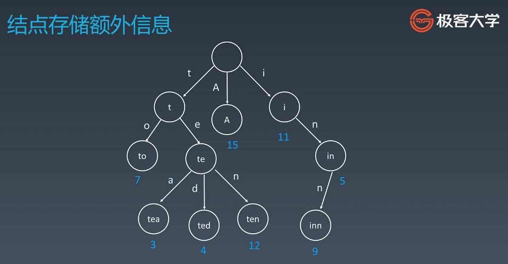
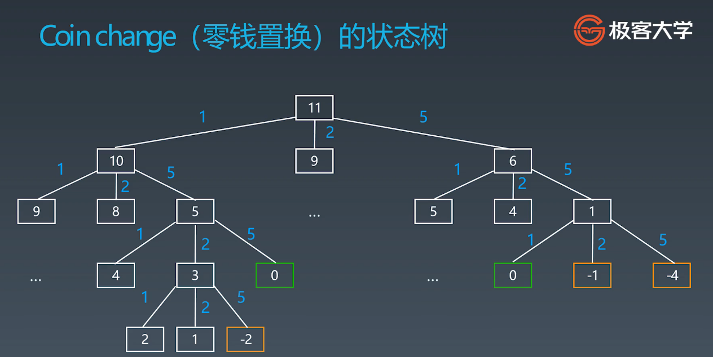

学习笔记### 字典树和并查集

字典树：Trie

#### 基本结构
字典树，即Trie树，又称单词查找树或键树，是一种树形结构。典型应用于统计和排序大量的字符串（但不仅限于字符串），所以经常被搜索引擎系统用于文本词频统计。

#### 示意图

1. 结点本身不存完整单词，
2. 从根结点到某一结点，路径上所经过的字符连接起来，为该节点对应的字符串
3. 每个结点的所有子结点路径所代表的的字符都不相同

#### 优点
最大限度的减少无谓的字符串比较，查询效率比哈希表高


#### trie树代码模板

java

```
class Trie {
    private boolean isEnd;
    private Trie[] next;
    /** Initialize your data structure here. */
    public Trie() {
        isEnd = false;
        next = new Trie[26];
    }
    
    /** Inserts a word into the trie. */
    public void insert(String word) {
        if (word == null || word.length() == 0) return;
        Trie curr = this;
        char[] words = word.toCharArray();
        for (int i = 0;i < words.length;i++) {
            int n = words[i] - 'a';
            if (curr.next[n] == null) curr.next[n] = new Trie();
            curr = curr.next[n];
        }
        curr.isEnd = true;
    }
    
    /** Returns if the word is in the trie. */
    public boolean search(String word) {
        Trie node = searchPrefix(word);
        return node != null && node.isEnd;
    }
    
    /** Returns if there is any word in the trie that starts with the given prefix. */
    public boolean startsWith(String prefix) {
        Trie node = searchPrefix(prefix);
        return node != null;
    }

    private Trie searchPrefix(String word) {
        Trie node = this;
        char[] words = word.toCharArray();
        for (int i = 0;i < words.length;i++) {
            node = node.next[words[i] - 'a'];
            if (node == null) return null;
        }
        return node;
    }
}
```

python

```
class Trie(object):
  
    def __init__(self): 
        self.root = {} 
        self.end_of_word = "#" 
 
    def insert(self, word): 
        node = self.root 
        for char in word: 
            node = node.setdefault(char, {}) 
        node[self.end_of_word] = self.end_of_word 
 
    def search(self, word): 
        node = self.root 
        for char in word: 
            if char not in node: 
                return False 
            node = node[char] 
        return self.end_of_word in node 
 
    def startsWith(self, prefix): 
        node = self.root 
        for char in prefix: 
            if char not in node: 
                return False 
            node = node[char] 
        return True
```


### 并查集


#### 试用场景

组团，配对问题
Group or not

#### 基础操作

1. makeSet(s):建立一个新的并查集，其中包含s个单元素集合
2. unionSet(x,y): 把元素x和元素y所在的集合合并，要去x和y所在的集合不相交，如果相交则不合并
3. find(x):找到元素x所在的集合的代表，该操作也可以用于判断两个元素师傅位于同一个集合，只要将他们各自的代表比较一下就可以了


#### 代码模板
java
```
class UnionFind { 
	private int count = 0; 
	private int[] parent; 
	public UnionFind(int n) { 
		count = n; 
		parent = new int[n]; 
		for (int i = 0; i < n; i++) { 
			parent[i] = i;
		}
	} 
	public int find(int p) { 
		while (p != parent[p]) { 
			parent[p] = parent[parent[p]]; 
			p = parent[p]; 
		}
		return p; 
	}
	public void union(int p, int q) { 
		int rootP = find(p); 
		int rootQ = find(q); 
		if (rootP == rootQ) return; 
		parent[rootP] = rootQ; 
		count--;
	}
}
```

python
```
def init(p): 
	# for i = 0 .. n: p[i] = i; 
	p = [i for i in range(n)] 
 
def union(self, p, i, j): 
	p1 = self.parent(p, i) 
	p2 = self.parent(p, j) 
	p[p1] = p2 
 
def parent(self, p, i): 
	root = i 
	while p[root] != root: 
		root = p[root] 
	while p[i] != i: # 路径压缩 ?
		x = i; i = p[i]; p[x] = root 
	return root
```


### 剪枝

#### 初级搜索
1. 朴素搜索
2. 优化方向: 不重复（fibonacci）,剪枝（括号生成问题）
3. 搜索方向：
   1. 深度优先搜索 DES
   2. 广度优先搜索：BFS
   3. 双向搜索，启发式搜索


#### 零钱置换状态树



#### 启发式搜索，A*代码模板
java
```
public class AStar
    {
        public final static int BAR = 1; // 障碍值
        public final static int PATH = 2; // 路径
        public final static int DIRECT_VALUE = 10; // 横竖移动代价
        public final static int OBLIQUE_VALUE = 14; // 斜移动代价
        
        Queue<Node> openList = new PriorityQueue<Node>(); // 优先队列(升序)
        List<Node> closeList = new ArrayList<Node>();
        
        /**
         * 开始算法
         */
        public void start(MapInfo mapInfo)
        {
            if(mapInfo==null) return;
            // clean
            openList.clear();
            closeList.clear();
            // 开始搜索
            openList.add(mapInfo.start);
            moveNodes(mapInfo);
        }
    

        /**
         * 移动当前结点
         */
        private void moveNodes(MapInfo mapInfo)
        {
            while (!openList.isEmpty())
            {
                Node current = openList.poll();
                closeList.add(current);
                addNeighborNodeInOpen(mapInfo,current);
                if (isCoordInClose(mapInfo.end.coord))
                {
                    drawPath(mapInfo.maps, mapInfo.end);
                    break;
                }
            }
        }
        
        /**
         * 在二维数组中绘制路径
         */
        private void drawPath(int[][] maps, Node end)
        {
            if(end==null||maps==null) return;
            System.out.println("总代价：" + end.G);
            while (end != null)
            {
                Coord c = end.coord;
                maps[c.y][c.x] = PATH;
                end = end.parent;
            }
        }
    

        /**
         * 添加所有邻结点到open表
         */
        private void addNeighborNodeInOpen(MapInfo mapInfo,Node current)
        {
            int x = current.coord.x;
            int y = current.coord.y;
            // 左
            addNeighborNodeInOpen(mapInfo,current, x - 1, y, DIRECT_VALUE);
            // 上
            addNeighborNodeInOpen(mapInfo,current, x, y - 1, DIRECT_VALUE);
            // 右
            addNeighborNodeInOpen(mapInfo,current, x + 1, y, DIRECT_VALUE);
            // 下
            addNeighborNodeInOpen(mapInfo,current, x, y + 1, DIRECT_VALUE);
            // 左上
            addNeighborNodeInOpen(mapInfo,current, x - 1, y - 1, OBLIQUE_VALUE);
            // 右上
            addNeighborNodeInOpen(mapInfo,current, x + 1, y - 1, OBLIQUE_VALUE);
            // 右下
            addNeighborNodeInOpen(mapInfo,current, x + 1, y + 1, OBLIQUE_VALUE);
            // 左下
            addNeighborNodeInOpen(mapInfo,current, x - 1, y + 1, OBLIQUE_VALUE);
        }
    

        /**
         * 添加一个邻结点到open表
         */
        private void addNeighborNodeInOpen(MapInfo mapInfo,Node current, int x, int y, int value)
        {
            if (canAddNodeToOpen(mapInfo,x, y))
            {
                Node end=mapInfo.end;
                Coord coord = new Coord(x, y);
                int G = current.G + value; // 计算邻结点的G值
                Node child = findNodeInOpen(coord);
                if (child == null)
                {
                    int H=calcH(end.coord,coord); // 计算H值
                    if(isEndNode(end.coord,coord))
                    {
                        child=end;
                        child.parent=current;
                        child.G=G;
                        child.H=H;
                    }
                    else
                    {
                        child = new Node(coord, current, G, H);
                    }
                    openList.add(child);
                }
                else if (child.G > G)
                {
                    child.G = G;
                    child.parent = current;
                    openList.add(child);
                }
            }
        }
    

        /**
         * 从Open列表中查找结点
         */
        private Node findNodeInOpen(Coord coord)
        {
            if (coord == null || openList.isEmpty()) return null;
            for (Node node : openList)
            {
                if (node.coord.equals(coord))
                {
                    return node;
                }
            }
            return null;
        }
    
        /**
         * 计算H的估值：“曼哈顿”法，坐标分别取差值相加
         */
        private int calcH(Coord end,Coord coord)
        {
            return Math.abs(end.x - coord.x)
                    + Math.abs(end.y - coord.y);
        }
        
        /**
         * 判断结点是否是最终结点
         */
        private boolean isEndNode(Coord end,Coord coord)
        {
            return coord != null && end.equals(coord);
        }
    

        /**
         * 判断结点能否放入Open列表
         */
        private boolean canAddNodeToOpen(MapInfo mapInfo,int x, int y)
        {
            // 是否在地图中
            if (x < 0 || x >= mapInfo.width || y < 0 || y >= mapInfo.hight) return false;
            // 判断是否是不可通过的结点
            if (mapInfo.maps[y][x] == BAR) return false;
            // 判断结点是否存在close表
            if (isCoordInClose(x, y)) return false;
    

            return true;
        }
    

        /**
         * 判断坐标是否在close表中
         */
        private boolean isCoordInClose(Coord coord)
        {
            return coord!=null&&isCoordInClose(coord.x, coord.y);
        }
    

        /**
         * 判断坐标是否在close表中
         */
        private boolean isCoordInClose(int x, int y)
        {
            if (closeList.isEmpty()) return false;
            for (Node node : closeList)
            {
                if (node.coord.x == x && node.coord.y == y)
                {
                    return true;
                }
            }
            return false;
        }
    }
```

python
```
def AstarSearch(graph, start, end):
    pq = collections.priority_queue() # 优先级 —> 估价函数
    pq.append([start]) 
    visited.add(start)
    while pq: 
        node = pq.pop() 
        visited.add(node)
        process(node) 
        nodes = generate_related_nodes(node) 
        unvisited = [node for node in nodes if node not in visited]
        pq.push(unvisited)
```