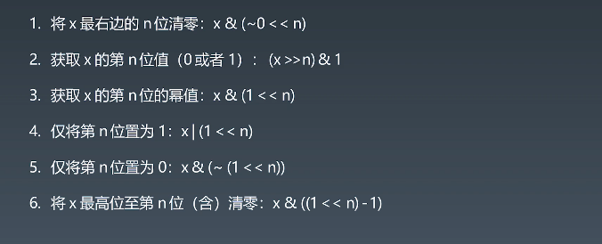
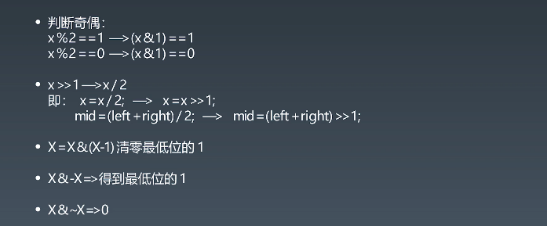

### 学习笔记

#### 位运算

##### 指定位置的位运算


##### 实战位运算要点


##### n皇后位运算实例
python
```
def totalNQueens(self, n): 
    if n < 1: return [] 
    self.count = 0 
    self.DFS(n, 0, 0, 0, 0) 
    return self.count
def DFS(self, n, row, cols, pie, na): 
    # recursion terminator 
    if row >= n: 
        self.count += 1 
        return
    bits = (~(cols | pie | na)) & ((1 << n) — 1)  # 得到当前所有的空位
    while bits: 
        p = bits & —bits # 取到最低位的1
        bits = bits & (bits — 1) # 表示在p位置上放入皇后
        self.DFS(n, row + 1, cols | p, (pie | p) << 1, (na | p) >> 1) 
        # 不需要revert cols, pie, na 的状态
```

java
```

class Solution {
    private int size; 
    private int count;
    private void solve(int row, int ld, int rd) { 
        if (row == size) { 
            count++; 
            return; 
        }
        int pos = size & (~(row | ld | rd)); 
        while (pos != 0) { 
            int p = pos & (-pos); 
            pos -= p; // pos &= pos - 1; 
            solve(row | p, (ld | p) << 1, (rd | p) >> 1); 
        } 
    } 
    public int totalNQueens(int n) { 
        count = 0; 
        size = (1 << n) - 1; 
        solve(0, 0, 0); 
        return count; 
    } 
    }
```

#### 布隆过滤器

##### 参考链接
[布隆过滤器(Bloom Filter)的原理和实现](https://www.cnblogs.com/cpselvis/p/6265825.html)
[使用BloomFilter布隆过滤器解决缓存击穿、垃圾邮件识别、集合判重](https://blog.csdn.net/tianyaleixiaowu/article/details/74721877)

##### 代码实例

[布隆过滤器java实现](https://github.com/lovasoa/bloomfilter/blob/master/src/main/java/BloomFilter.java)
[高性能布隆过滤器python实现](https://github.com/jhgg/pybloof)
python
```
from bitarray import bitarray 
import mmh3


class BloomFilter: 
    def __init__(self, size, hash_num): 
        self.size = size 
        self.hash_num = hash_num 
        self.bit_array = bitarray(size) 
        self.bit_array.setall(0) 
    def add(self, s): 
        for seed in range(self.hash_num): 
            result = mmh3.hash(s, seed) % self.size 
            self.bit_array[result] = 1 
    def lookup(self, s): 
        for seed in range(self.hash_num): 
            result = mmh3.hash(s, seed) % self.size 
            if self.bit_array[result] == 0: 
                return "Nope" 
        return "Probably" 
bf = BloomFilter(500000, 7) 
bf.add("dantezhao") 
print (bf.lookup("dantezhao")) 
print (bf.lookup("yyj")) 
```

java
```
public class BloomFilter {
    private static final int DEFAULT_SIZE = 2 << 24;
    private static final int[] seeds = new int[] { 5, 7, 11, 13, 31, 37, 61 };
    private BitSet bits = new BitSet(DEFAULT_SIZE);
    private SimpleHash[] func = new SimpleHash[seeds.length];
    public BloomFilter() {
        for (int i = 0; i < seeds.length; i++) {
            func[i] = new SimpleHash(DEFAULT_SIZE, seeds[i]);
        }
    }
    public void add(String value) {
        for (SimpleHash f : func) {
            bits.set(f.hash(value), true);
        }
    }
    public boolean contains(String value) {
        if (value == null) {
            return false;
        }
        boolean ret = true;
        for (SimpleHash f : func) {
            ret = ret && bits.get(f.hash(value));
        }
        return ret;
    }
    // 内部类, simpleHash
    public static class SimpleHash {
        private int cap;
        private int seed;
        public SimpleHash(int cap, int seed) {
            this.cap = cap;
            this.seed = seed;
        }
        public int hash(String value) {
            int result = 0;
            int len = value.length();
            for (int i = 0; i < len; i++) {
                result = seed * result + value.charAt(i);
            }
            return (cap - 1) & result;
        }
    }
}
```


##### LRU Cache
python
```
class LRUCache(object): 

    def __init__(self, capacity): 
        self.dic = collections.OrderedDict() 
        self.remain = capacity

    def get(self, key): 
        if key not in self.dic: 
            return -1 
        v = self.dic.pop(key) 
        self.dic[key] = v   # key as the newest one 
        return v 

    def put(self, key, value): 
        if key in self.dic: 
            self.dic.pop(key) 
        else: 
            if self.remain > 0: 
                self.remain -= 1 
            else:   # self.dic is full
                self.dic.popitem(last=False) 
        self.dic[key] = value
```

java使用 哈希表 + 双端链表 实现
```
class LinkedNode {
  constructor(key = 0, val = 0) {
    this.key = key
    this.val = val
    this.prev = null
    this.next = null
  }
}


class LinkedList {
  constructor() {
    this.head = new LinkedNode()
    this.tail = new LinkedNode()
    this.head.next = this.tail
    this.tail.prev = this.head
  }


  insertFirst(node) {
    node.next = this.head.next
    node.prev = this.head
    this.head.next.prev = node
    this.head.next = node
  }


  remove(node) {
    node.prev.next = node.next
    node.next.prev = node.prev
  }


  removeLast() {
    if (this.tail.prev === this.head) return null
    let last = this.tail.prev
    this.remove(last)
    return last
  }
}


/**
 * @param {number} capacity
 */
var LRUCache = function(capacity) {
  this.capacity = capacity
  this.keyNodeMap = new Map()
  this.cacheLink = new LinkedList()
};


/** 
 * @param {number} key
 * @return {number}
 */
LRUCache.prototype.get = function(key) {
  if (!this.keyNodeMap.has(key)) return -1
  let val = this.keyNodeMap.get(key).val
  this.put(key, val)
  return val
};


/** 
 * @param {number} key 
 * @param {number} value
 * @return {void}
 */
LRUCache.prototype.put = function(key, value) {
  let size = this.keyNodeMap.size
  if (this.keyNodeMap.has(key)) {
    this.cacheLink.remove(this.keyNodeMap.get(key)); 
    --size 
  }
  if (size >= this.capacity) {
    this.keyNodeMap.delete(this.cacheLink.removeLast().key)
  }
  let node = new LinkedNode(key, value)
  this.keyNodeMap.set(key, node)
  this.cacheLink.insertFirst(node)
};
```

```
class LRUCache {
    /**
     * 缓存映射表
     */
    private Map<Integer, DLinkNode> cache = new HashMap<>();
    /**
     * 缓存大小
     */
    private int size;
    /**
     * 缓存容量
     */
    private int capacity;
    /**
     * 链表头部和尾部
     */
    private DLinkNode head, tail;

    public LRUCache(int capacity) {
        //初始化缓存大小，容量和头尾节点
        this.size = 0;
        this.capacity = capacity;
        head = new DLinkNode();
        tail = new DLinkNode();
        head.next = tail;
        tail.prev = head;
    }

    /**
     * 获取节点
     * @param key 节点的键
     * @return 返回节点的值
     */
    public int get(int key) {
        DLinkNode node = cache.get(key);
        if (node == null) {
            return -1;
        }
        //移动到链表头部
         (node);
        return node.value;
    }

    /**
     * 添加节点
     * @param key 节点的键
     * @param value 节点的值
     */
    public void put(int key, int value) {
        DLinkNode node = cache.get(key);
        if (node == null) {
            DLinkNode newNode = new DLinkNode(key, value);
            cache.put(key, newNode);
            //添加到链表头部
            addToHead(newNode);
            ++size;
            //如果缓存已满，需要清理尾部节点
            if (size > capacity) {
                DLinkNode tail = removeTail();
                cache.remove(tail.key);
                --size;
            }
        } else {
            node.value = value;
            //移动到链表头部
            moveToHead(node);
        }
    }

    /**
     * 删除尾结点
     *
     * @return 返回删除的节点
     */
    private DLinkNode removeTail() {
        DLinkNode node = tail.prev;
        removeNode(node);
        return node;
    }

    /**
     * 删除节点
     * @param node 需要删除的节点
     */
    private void removeNode(DLinkNode node) {
        node.next.prev = node.prev;
        node.prev.next = node.next;
    }

    /**
     * 把节点添加到链表头部
     *
     * @param node 要添加的节点
     */
    private void addToHead(DLinkNode node) {
        node.prev = head;
        node.next = head.next;
        head.next.prev = node;
        head.next = node;
    }

    /**
     * 把节点移动到头部
     * @param node 需要移动的节点
     */
    private void moveToHead(DLinkNode node) {
        removeNode(node);
        addToHead(node);
    }

    /**
     * 链表节点类
     */
    private static class DLinkNode {
        Integer key;
        Integer value;
        DLinkNode prev;
        DLinkNode next;

        DLinkNode() {
        }

        DLinkNode(Integer key, Integer value) {
            this.key = key;
            this.value = value;
        }
    }
}
```


#### 排序算法


[十大经典排序算法](https://www.cnblogs.com/onepixel/p/7674659.html)

##### 冒泡排序
```
def bubble_sort(array):
    for i in range(1, len(array)):
        for j in range(0, len(array)-i):
            if array[j] > array[j+1]:
                array[j], array[j+1] = array[j+1], array[j]
    return array

```

##### 选择排序
```
def selection_sort(arr):
    for i in range(len(arr) - 1):
        min_index = i
        for j in range(i + 1, len(arr)):
            if arr[j] < arr[min_index]:
                min_index = j
        arr[min_index], arr[i] = arr[i], arr[min_index]
    return arr
```

##### 插入排序
```
def insert_sort(data):
    for i in range(1, len(data)):
        value = data[i]
        j = i-1
        while j >= 0:
            if  data[j] > value:
                data[j+1] = data[j]
            else :
                break
            j -= 1

        data[j+1] = value
    return data
```

##### 希尔排序
```
import math
def shell_sort(arr):
    gap = 1
    while(gap < len(arr)/3):
        gap = gap*3+1
    while gap > 0:
        for i in range(gap, len(arr)):
            temp = arr[i]
            j = i-gap
            while j >= 0 and arr[j] > temp:
                arr[j+gap] = arr[j]
                j -= gap
            arr[j+gap] = temp
        gap = math.floor(gap/3)
    return arr
```

##### 快速排序
```
def quick_sort(begin, end, nums):
    if begin >= end:
        return
    pivot_index = partition(begin, end, nums)
    quick_sort(begin, pivot_index-1, nums)
    quick_sort(pivot_index+1, end, nums)
    
def partition(begin, end, nums):
    pivot = nums[begin]
    mark = begin
    for i in range(begin+1, end+1):
        if nums[i] < pivot:
            mark +=1
            nums[mark], nums[i] = nums[i], nums[mark]
    nums[begin], nums[mark] = nums[mark], nums[begin]
    return mark
```

##### 归并排序
```
def mergesort(nums, left, right):
    if right <= left:
        return
    mid = (left+right) >> 1
    mergesort(nums, left, mid)
    mergesort(nums, mid+1, right)
    merge(nums, left, mid, right)

def merge(nums, left, mid, right):
    temp = []
    i = left
    j = mid+1
    while i <= mid and j <= right:
        if nums[i] <= nums[j]:
            temp.append(nums[i])
            i +=1
        else:
            temp.append(nums[j])
            j +=1
    while i<=mid:
        temp.append(nums[i])
        i +=1
    while j<=right:
        temp.append(nums[j])
        j +=1
    nums[left:right+1] = temp
```

##### 堆排序
```
def heapify(parent_index, length, nums):
    temp = nums[parent_index]
    child_index = 2*parent_index+1
    while child_index < length:
        if child_index+1 < length and nums[child_index+1] > nums[child_index]:
            child_index = child_index+1
        if temp > nums[child_index]:
            break
        nums[parent_index] = nums[child_index]
        parent_index = child_index
        child_index = 2*parent_index + 1
    nums[parent_index] = temp


def heapsort(nums):
    for i in range((len(nums)-2)//2, -1, -1):
        heapify(i, len(nums), nums)
    for j in range(len(nums)-1, 0, -1):
        nums[j], nums[0] = nums[0], nums[j]
        heapify(0, j, nums)
```