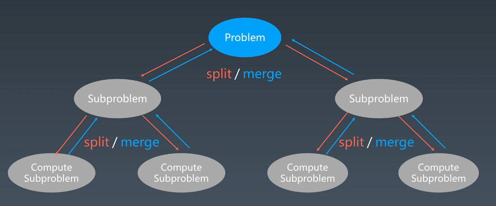
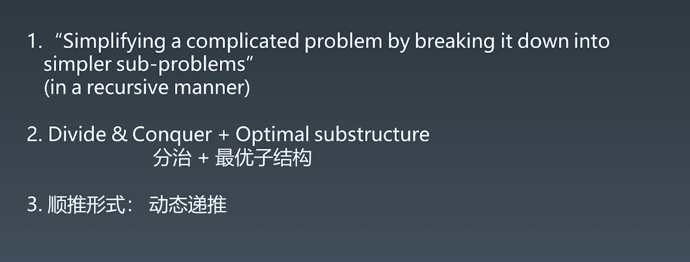
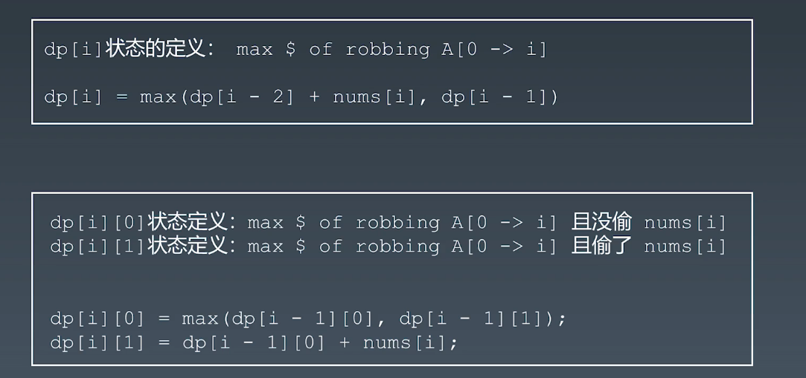
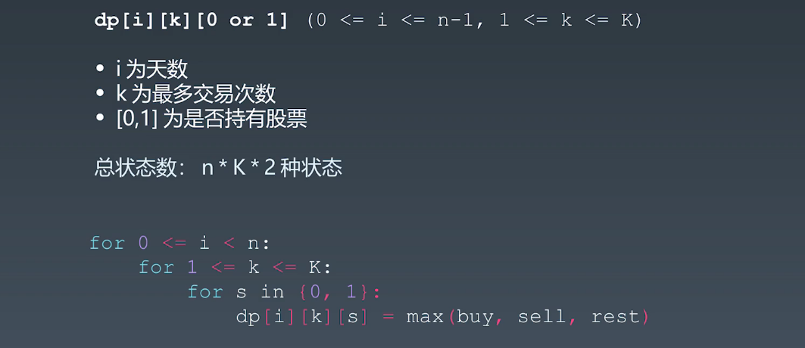
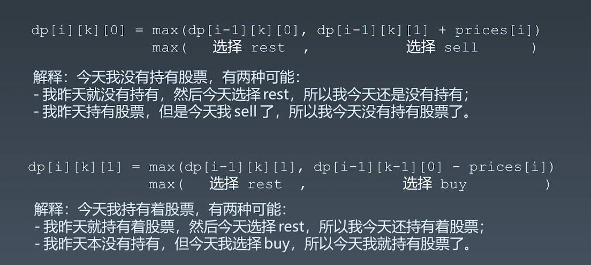
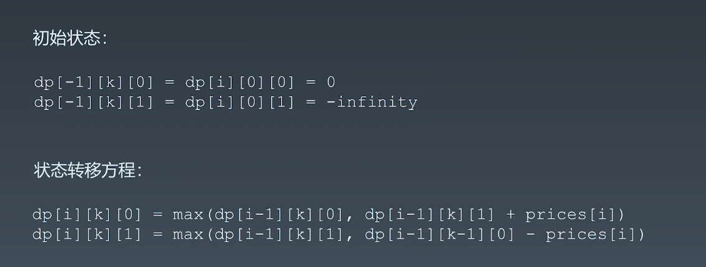
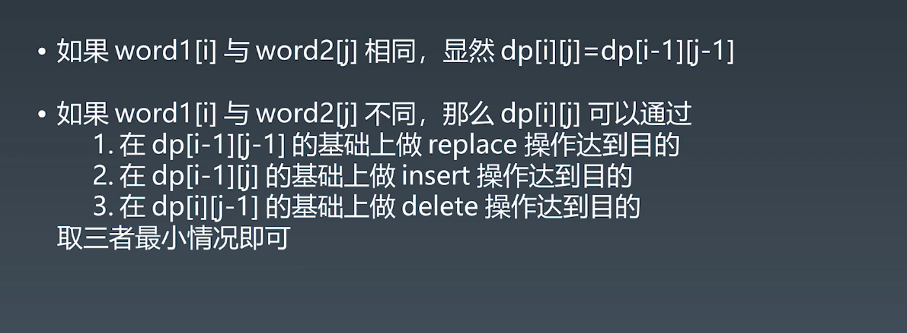

### 递归状态树

### 动态规划

#### DP顺推模板
```
function DP():
    dp = [][] #二维情况

    for i =0 .. M{
        for j =0 .. M{
            dp[i][j] = _function(dp[i'][j']...)
        }
    }
```

#### 动态转移方程记录
打家劫舍


股票买卖




编辑距离



#### Atoi代码示例
java
```
public int myAtoi(String str) {
    int index = 0, sign = 1, total = 0;

    //1. Empty string
    if(str.length() == 0) return 0;

    //2. Remove Spaces
    while(str.charAt(index) == ' ' && index < str.length())
        index ++;

    //3. Handle signs
    if(str.charAt(index) == '+' || str.charAt(index) == '-'){
        sign = str.charAt(index) == '+' ? 1 : -1;
        index ++;
    }
    
    //4. Convert number and avoid overflow
    while(index < str.length()){
        int digit = str.charAt(index) - '0';
        if(digit < 0 || digit > 9) break;

        //check if total will be overflow after 10 times and add digit
        if(Integer.MAX_VALUE/10 < total ||            
        	Integer.MAX_VALUE/10 == total && Integer.MAX_VALUE %10 < digit)
            return sign == 1 ? Integer.MAX_VALUE : Integer.MIN_VALUE;
        total = 10 * total + digit;
        index ++;
    }
    return total * sign;
}
```

python
```
class Solution(object):
    def myAtoi(self, s):
        if len(s) == 0 : return 0
        ls = list(s.strip())
        
        sign = -1 if ls[0] == '-' else 1
        if ls[0] in ['-','+'] : del ls[0]
        ret, i = 0, 0
        while i < len(ls) and ls[i].isdigit() :
            ret = ret*10 + ord(ls[i]) - ord('0')
            i += 1
        return max(-2**31, min(sign * ret,2**31-1))
```

#### 字符串匹配算法

1. 暴力法
2. [Boyer-Moore 算法](https://www.ruanyifeng.com/blog/2013/05/boyer-moore_string_search_algorithm.html)
3. [Sunday 算法](https://blog.csdn.net/u012505432/article/details/52210975)
   

#### 字符串匹配暴力法代码示例
java
```
public static int forceSearch(String txt, String pat) {
    int M = txt.length();
    int N = pat.length();
    for (int i = 0; i <= M - N; i++) {
        int j;
        for (j = 0; j < N; j++) {
            if (txt.charAt(i + j) != pat.charAt(j))
                break;
        }
        if (j == N) {
            return i;
        }
        // 更加聪明？ 
        // 1. 预先判断 hash(txt.substring(i, M)) == hash(pat)
        // 2. KMP 
    }
    return -1;
}
```

python
```
# Python
def forceSearch(txt, pat):
    n, m = len(txt), len(pat)
    for i in range(n-m+1):
        for j in range(m):
        if txt[i+j] != pat[j]:
            break
        if j == m:
        return i
    return -1 
```

#### Rabin-Karp 代码示例
java
```
public final static int D = 256;
public final static int Q = 9997;

static int RabinKarpSerach(String txt, String pat) {
    int M = pat.length();
    int N = txt.length();
    int i, j;
    int patHash = 0, txtHash = 0;

    for (i = 0; i < M; i++) {
        patHash = (D * patHash + pat.charAt(i)) % Q;
        txtHash = (D * txtHash + txt.charAt(i)) % Q;
    }

    int highestPow = 1;  // pow(256, M-1)
    for (i = 0; i < M - 1; i++) 
        highestPow = (highestPow * D) % Q;

    for (i = 0; i <= N - M; i++) { // 枚举起点
        if (patHash == txtHash) {
            for (j = 0; j < M; j++) {
                if (txt.charAt(i + j) != pat.charAt(j))
                    break;
            }
            if (j == M)
                return i;
        }
        if (i < N - M) {
            txtHash = (D * (txtHash - txt.charAt(i) * highestPow) + txt.charAt(i + M)) % Q;
            if (txtHash < 0)
                txtHash += Q;
        }
    }

    return -1;
}
```

python

```
class Solution:
    def strStr(self, haystack: str, needle: str) -> int:
        d = 256
        q = 9997
        n = len(haystack)
        m = len(needle)
        h = pow(d,m-1)%q
        p = 0
        t = 0
        if m > n:
            return -1
        for i in range(m): # preprocessing
            p = (d*p+ord(needle[i]))%q
            t = (d*t+ord(haystack[i]))%q
        for s in range(n-m+1): # note the +1
            if p == t: # check character by character
                match = True
                for i in range(m):
                    if needle[i] != haystack[s+i]:
                        match = False
                        break
                if match:
                    return s
            if s < n-m:
                t = (t-h*ord(haystack[s]))%q
                t = (t*d+ord(haystack[s+m]))%q
                t = (t+q)%q
        return -1

```

[字符串匹配的 KMP 算法](http://www.ruanyifeng.com/blog/2013/05/Knuth%E2%80%93Morris%E2%80%93Pratt_algorithm.html)
[KMP 字符串匹配算法视频](https://www.bilibili.com/video/av11866460?from=search&seid=17425875345653862171)